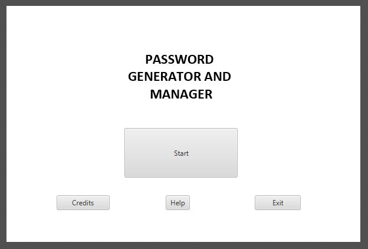
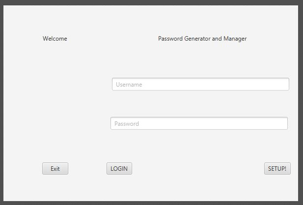
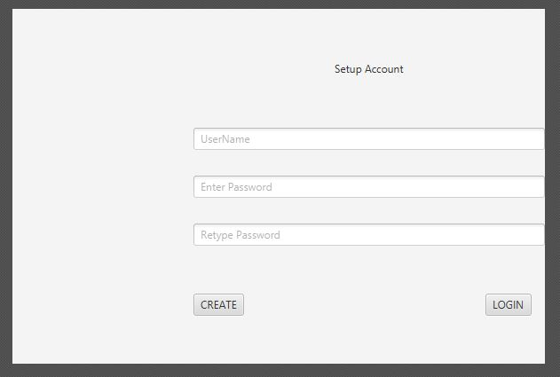
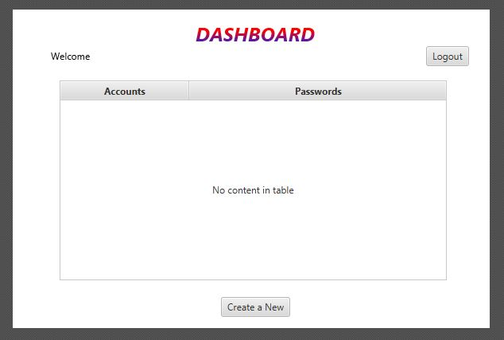
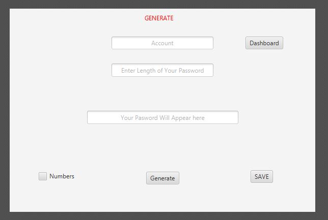
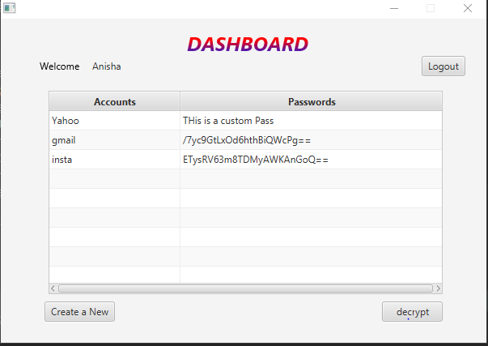
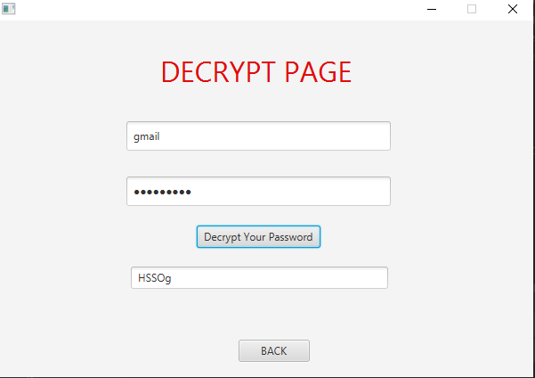

# PassMan
## Password Manager and Secure Password Generator
#### About Project

A One-Stop-Solution for all passwords needs, From Generation of complex Passwords to Storing them

Storage on SQL server using XAMPP
***
**Features**

 - Interactive UI
 - Secure offline, local storage
 - Multiple Users
 - Encryption and decryption of passwords
 - Multiple Passwords Per User
 - Randomization Flexibility
 - Operating System Independent
 - Password Choices
	 - User Defined
	 - Random only Characters
	 - Random with Numbers
	 - Random with Numbers and Characters
	 - Length Flexibility

***
#### Developed by: 
[**Agnellus Fernandes**](https://www.linkedin.com/in/agnellus-fernandes-81232b192)

[**Anisha Fernandes**](https://www.linkedin.com/in/anisha-fernandes-9063651a1)
***
#### Screenshots!

Welcome

Login

Register

Dashboard

Generate

Encryption

Decryption

***
**Tools used**

 - Java 8
 - Intellij IDEA
 - Xampp
 - Gluon Scene Builder
